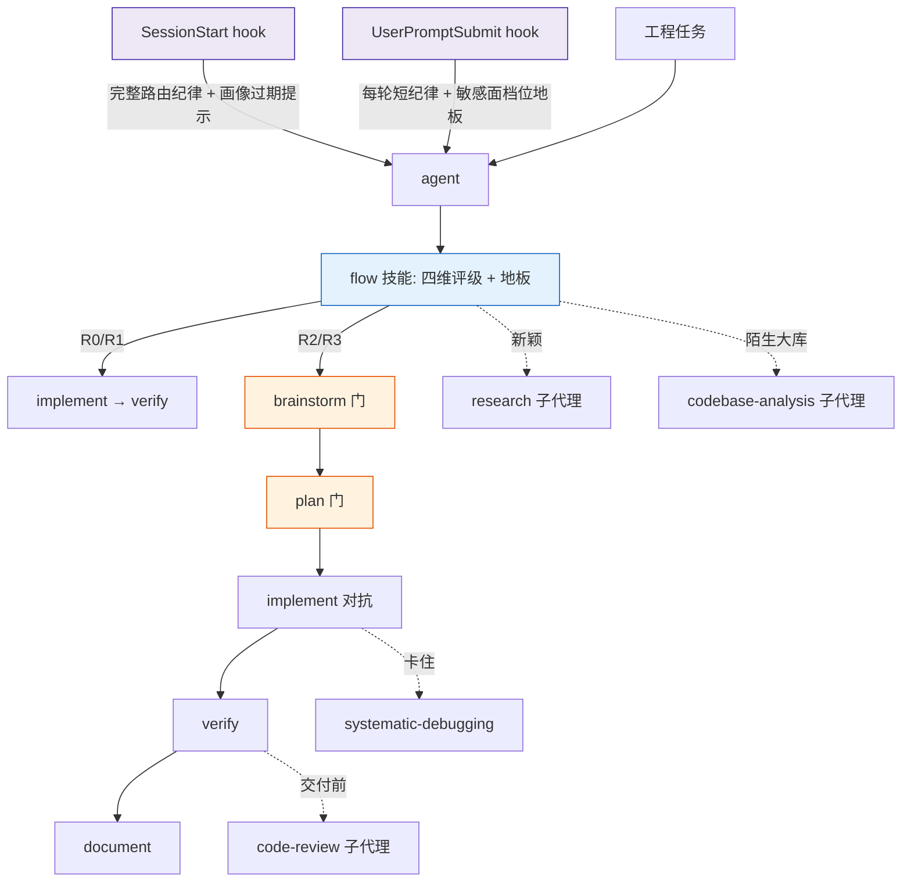
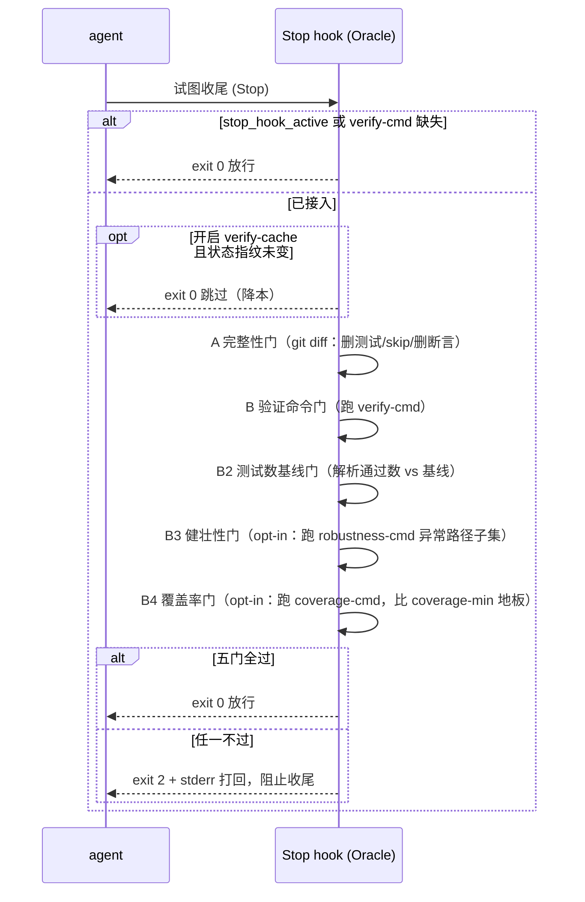

# Flow 技术方案

## 1. 概述

Flow 把「按复杂度选择流程深度、完成须附验证证据」固化为一组原生 Claude Code 技能，并以三支 hook 提供机制兜底。运行时由两类组件构成：

- **三支 hook** — `SessionStart` / `UserPromptSubmit` / `Stop`，分别负责注入路由纪律、对抗上下文衰减与档位压低、独立裁决完成。
- **一组按需加载的技能** — 评级与各流程能力以 `SKILL.md` 提供，由 agent 通过原生 `Skill`、`Task`、`TodoWrite` 与 plan mode 编排。

除三支 hook 外不引入常驻进程或命令行工具。持久状态仅是项目接入门控时写入 `docs/flow/` 的少量文件，全部 opt-in、可随时删除。

## 2. 组成

| 组件 | 路径 | 职责 |
|---|---|---|
| 引导 hook | `hooks/flow-bootstrap.sh` | `SessionStart` 注入完整路由纪律；项目画像过期时附提示 |
| 重注入 hook | `hooks/flow-reinject.sh` | `UserPromptSubmit` 每轮注入短纪律；命中敏感面关键词时附档位地板提示；`#skip-flow` 静默放行 |
| Oracle hook | `hooks/flow-oracle.sh` | `Stop` 时以独立进程跑五道门（完整性/验证/测试数基线/健壮性/覆盖率）裁决完成，失败 `exit 2` 打回 |
| hook 声明 | `hooks/hooks.json` | 注册上述三支 hook（随插件自动加载） |
| 体检脚本 | `hooks/flow-doctor.sh` | 按需（非 hook、不自动跑）：在项目 cwd 只读体检 Oracle/B3/B4/cross 接入态 + 外部 agent 健康，退出码 0=Oracle 接入/1=未接入。由 `flow-doctor` 技能调用，也可人/CI 直跑 |
| 总路由技能 | `skills/flow/SKILL.md` | 评级 rubric、档位流程映射、档位地板、质量红线、升维规则 |
| 流程技能 | `skills/<name>/SKILL.md` | 20 支技能（见 §6） |
| 参考与脚本 | `skills/<name>/references/` | 深主题外置、产物示例模板、引用校验器 `verify-citations.sh`（深档硬门） |

技能元数据仅含 `name`（须等于目录名）与 `description`（触发条件 + 双语可检索关键词），由 Claude Code 自动发现，无注册表。`docs/flow/` 下文件是运行时产物，非插件自带配置。

## 3. 控制流

会话开始时 `SessionStart` 注入完整路由纪律（`compact`/`clear` 后重注入）；`UserPromptSubmit` 每轮补一句短纪律，填补会话内上下文增长导致提示被埋没的窗口，并在命中敏感面关键词时叠加档位地板提示。agent 收到工程任务后先用 `flow` 评级，再按档位逐步加载流程技能；每支技能仅在加载时进入主上下文，重活（调研、画像、评审、调试）派子代理只回传蒸馏结论。

## 4. 复杂度路由

评级维度为影响面、不可逆性、未知度、风险，各取 0–3，求和映射档位（R0 0–1 / R1 2–4 / R2 5–8 / R3 9–12）。验证深度随档位递增：R0 冒烟、R1 单测、R2 单测+集成、R3 增关键路径 E2E。

档位在单个任务内判定一次并沿用。覆盖标记 `#R0`–`#R3` / `#skip-flow` / `#new`。

**档位地板**：判档是 agent 自评，可被压低以跳流程。触及高危面时档位有地板（≥ R2）：数据库迁移 / schema / 破坏性 SQL、认证 / 鉴权 / 权限 / 密钥、CI / 发布 / 部署 / 生产数据、支付 / 计费 / 资金。`flow-reinject` 在用户消息命中相应关键词（折叠大小写、中英）时贴出地板提示——压低档位与删测试「变绿」同性质，属违规。

## 5. 完成判定

完成由项目真实验证命令的新鲜输出裁决，分两级。

**验证命令的确定**（可靠性递降）：优先取 `docs/flow/project.md`（`profile` 固化）；缺失则 `verify` 现场探测，CI 配置 > 包/构建清单 > 代码采样。无 CI 用清单推断；无测试退化为 build + lint；无可用构建则判为不可自动验证，退回人工确认。

**两级保证**：纪律级（红线 + builder/verifier 角色分离，agent 自带证据）与机器级（`Stop` hook 独立 Oracle）。项目写入 `docs/flow/verify-cmd` 后即接入 Oracle。

**五道门**：

- **A 完整性门（语法层）** — 仅 git 仓库内。扫工作树相对 HEAD 的改动，检测：注入 skip/only/todo/xit/t.Skip/#[ignore]（净增）、测试断言净减少、删除测试文件、测试文件被 `assume-unchanged`/`skip-worktree` 隐藏、verify-cmd/robustness-cmd/coverage-cmd/coverage-min 自篡改。正当的测试增删须提交 `docs/flow/verify-allow-test-changes`（已提交才生效）显式豁免。
- **B 验证命令门** — 跑 verify-cmd，退出码即裁决；失败时把输出经 stderr 回灌。
- **B2 测试数基线门（语义层）** — 命令通过后解析 runner 输出的通过数（多 suite 求和），低于 `docs/flow/test-count` 即打回；首次绿建立基线，正当下降经豁免刷新。已修 bignum 基线致比较出错被静默放行的缺陷；并收紧「建立过基线后又变不可解析」（换 reporter/吞摘要绕过计数门）为打回。
- **B3 健壮性门（opt-in，治 happy-path 全绿即完成）** — 写 `docs/flow/robustness-cmd`（错误路径/异常场景测试子集）后生效：单独跑它，非 0 或其通过数（`robustness-count` 基线）下降即打回。把异常覆盖从 implement verifier 的提示词自述，升为机器可裁决的硬门。源头由 `plan` 的 Robustness-Cases 契约喂入。
- **B4 覆盖率门（opt-in，治「①同数语义掏空」的代理指标）** — 写 `docs/flow/coverage-cmd`（带覆盖率统计）后生效：退出码非 0、或解析覆盖率% 低于 `docs/flow/coverage-min`（严格 0..100 整数）绝对地板即打回。抓「删分支/删错误路径测试使覆盖率跌破地板」（计数门抓不到）；抓不到「同路径假断言」——那需变异。绝对地板而非动态基线（覆盖率 run 间抖动比测试数大，ratchet 会误门控）。

B2/B3 的通过数比较共用同一函数（bignum 修复只在一处）。Oracle 采用 `exit 2 + stderr` 契约而非 JSON 输出：stderr 可承载任意字节（引号、换行、ANSI），无需对原始命令输出做 JSON 转义。命中 `stop_hook_active` 放行以免死循环。

**变异测试刻意不入 Stop 门**：每次收尾跑变异是分钟级、会逼用户关掉整个 Oracle。变异留在 implement verifier 的 mutation 抽查 + profile 记录的 `mutation-cmd`（人按需 / CI 周期跑）——它是「同数语义掏空/假断言」的真根治，B4 覆盖率只是「分钟内可跑」的代理。

**降本（opt-in）**：写 `docs/flow/verify-cache` 后启用「自上次绿以来状态指纹未变即跳过全部门」。指纹 = HEAD + 工作树 diff + 未跟踪文件内容 + verify-cmd/robustness-cmd/coverage-cmd/coverage-min + 机器/仓库路径身份；默认关闭、仅 git、非 git/失败即回退到「跑」。

**威胁模型与边界（诚实声明）**：门控是「提高绕过成本 + 留审计痕迹」的纪律门，不是沙箱隔离。已知边界：grep 抓不到「删真断言同时加等量永真断言」的同数语义掏空——B4 覆盖率只是其代理（同路径假断言不降覆盖率），真根治需变异；verify-cmd 委托脚本的间接层、`.gitignore` 的测试依赖、拥有 commit 权限/直接改基线文件的对抗仍可绕过。为让门生效，建议把 `docs/flow/{verify-cmd,robustness-cmd,coverage-cmd,coverage-min,test-count,robustness-count,verify-allow-test-changes}` 纳入版本控制并人审其变更。完整威胁模型（边界①–⑬）见 `hooks/flow-oracle.sh` 头部注释。

## 6. 技能体系

20 支技能分六类，各自标明适用档位、流程位置、显式交接，末行继承统一质量红线（`skill-lint.sh` 机器校验末行统一红线句 + 双语 description）。

- **总路由** `flow`。
- **理解项目** `profile`（命令/风格/反模式 → `docs/flow/project.md`）· `codebase-analysis`（内部结构 → `docs/flow/codemap.md`）· `tech-debt-audit`（churn×complexity 热点 → `TECH_DEBT_AUDIT.md`）· `impact-analysis`（变更波及面 → `docs/flow/<change>/impact.md`）。
- **调研与对齐** `research`（fan-out，浅档/深档+引用校验硬门）· `brainstorm`（硬门）· `plan`（门）。
- **实现与验证** `implement`（builder/verifier 对抗）· `systematic-debugging`（四阶段根因，阶段三回 implement）· `verify` · `code-review`（独立 reviewer）· `cross-verify`（多模型对抗核心）· `subagent-driven-development`（串行隔离派发）。
- **体检** `flow-doctor`（体检 Oracle/B3/B4/cross 接入态 + 外部 agent 健康，区分机器强制 vs 纪律；调 `hooks/flow-doctor.sh`）。
- **交付与收尾** `diagram` · `document` · `finishing-a-development-branch` · `harvest`。
- **元** `writing-skills`。

这四类「理解项目」技能职责互斥、边界互指：`profile` 探「怎么跑/什么风格」，`codebase-analysis` 答「内部结构长什么样」，`tech-debt-audit` 评「哪里烂/动哪危险」，`impact-analysis` 算「这次改动会动到谁」。它们均只读、只产结构化制品、不查外网。

### 6.1 多模型对抗（opt-in，强化 builder ≠ verifier）

把「对抗证伪」一步的执行者从同模型子代理升级为**异模型/外部 agent**（首个适配器 Codex），用模型异质性消除同源盲点——使 builder 模型 ≠ verifier 模型。

- **`cross-verify` 技能**：多轮收敛闭环（派发→摄取裁决→回修→再派，直到无 Critical 或显式接受）；供 `implement`/`code-review` 升级验证、`plan`/`brainstorm` 做跨模型决策门。
- **opt-in + 降级**：仅当项目 `docs/flow/cross-verify` 声明适配器键（`codex-cli` / `grok-cli`）才启用；适配器健康检查失败即**显式降级回同模型基线**，不写则零侵入。缺 Codex 不致纪律失效。
- **派发底座** `skills/cross-verify/references/external-agent.sh`：一次性脚本（仿 `verify-citations.sh` 先例），封装健康检查 / 派发 / 可移植超时 / read-only 沙箱 / workspace-write 沙箱 / 优雅降级。**遵「除三支 hook 外不引入常驻进程或命令行工具」——非 hook、非常驻、无注册**。适配器可插拔，接新模型只需加一个 `case` 分支。**命名诚实**：脚本层只有 CLI 路径，适配器键统一 `codex-cli`（不叫 `codex-mcp`——真正的 in-session MCP 工具由 agent 在 skill 层直接调用，不经本脚本）。prompt 经 stdin/`--prompt-file` 传入（避免长 diff 撞 ARG_MAX）。健康检查只验 binary+auth，**端到端真实链路另由 `external-agent.smoke.sh`（`RUN_E2E=1`，有凭证时跑最小真调用并留证据）验**，补 stub argv 测试覆盖不到的 CLI flag 漂移盲点。
- **模型路由**：按角色而非工具品牌定档。planner/orchestrator、plan-review、diff review、verifier 使用最强可用模型；只在任务已拆清楚、独立、可机检时让 executor 低一档执行。Codex CLI 路径中 `dispatch` 使用 `CROSS_VERIFY_EFFORT`（默认 `high`），`dispatch-write` 使用 `CROSS_EXECUTE_EFFORT`（默认 `medium`）。完整规则见 `skills/flow/references/model-routing.md`。
- **不接入 Oracle**：Stop hook 仍是确定性命令门，往里塞 LLM 会破坏确定性；完成判定仍由 `verify` + Oracle 裁决。
- **结构机器门** `skills/_lint/skill-lint.sh`：校验技能契约（`name`==目录名、引用的 `references/*` 存在），让 SKILL.md 改动也有可运行验证。

## 7. 技能契约

- 元数据仅 `name`（须等于目录名）与 `description`（触发条件 + 可检索症状 + 双语关键词，不含工作流步骤）。
- 正文按需加载，保持密集；深主题或超 ~120 行的内容拆入 `skills/<name>/references/`，正文留指针。
- 行为塑造类技能须含「合理化借口 → 规则」红线表，逐条钉死可观察到的绕过借口；并含铁律、危险信号、正反例、checklist。
- 技能间交接以正文显式声明下一步技能，不依赖外部调度器。完成判定一律交回 `verify` + Oracle，不在技能内自造完成机制。

### 升维规则

同一问题连续失败时逐级提升处理策略（不在首次失败触发）：重读错误 → 换视角 → 搜全错误+读源码列 3 假设 → 构造最小复现重列假设 → 隔离 PoC / 换栈 / 质疑需求并结构化移交。调试卡住优先加载 `systematic-debugging` 做四阶段根因调试。

## 8. 运行时产物与边界

- `docs/flow/project.md` — 项目画像，`profile` 维护，供 `verify`/`implement`/`tech-debt-audit` 读取。
- `docs/flow/verify-cmd` — Oracle 的验证命令（单行），opt-in，缺失即 Oracle 放行。
- `docs/flow/test-count` — B2 基线（整数），建议提交并人审。
- `docs/flow/robustness-cmd` + `robustness-count` — B3 健壮性门的燃料（异常路径测试子集命令）与其通过数基线，opt-in。
- `docs/flow/coverage-cmd` + `coverage-min` — B4 覆盖率门的燃料（带覆盖率统计的命令）与覆盖率地板（0..100 整数），opt-in。
- `docs/flow/mutation-cmd` — 变异测试命令，仅 profile 记录、**不接 Oracle**（按需/CI 跑）。
- `docs/flow/verify-allow-test-changes` — 测试增删豁免标记，已提交才生效。
- `docs/flow/verify-cache` + `.last-green` — 降本开关与状态指纹。
- `docs/flow/<change>/` — 单个 change 的 context / design / tasks / research / sources / impact 工件。
- `docs/flow/codemap.md`、根目录 `TECH_DEBT_AUDIT.md` — 分析类技能产物。
- 经验沉淀写入项目 `lessons/` 或 `CLAUDE.md`，由原生上下文加载召回，无独立召回引擎。

所有 `docs/flow/` 产物均 opt-in 且可删除；删除后退回纯纪律级，插件零侵入。
