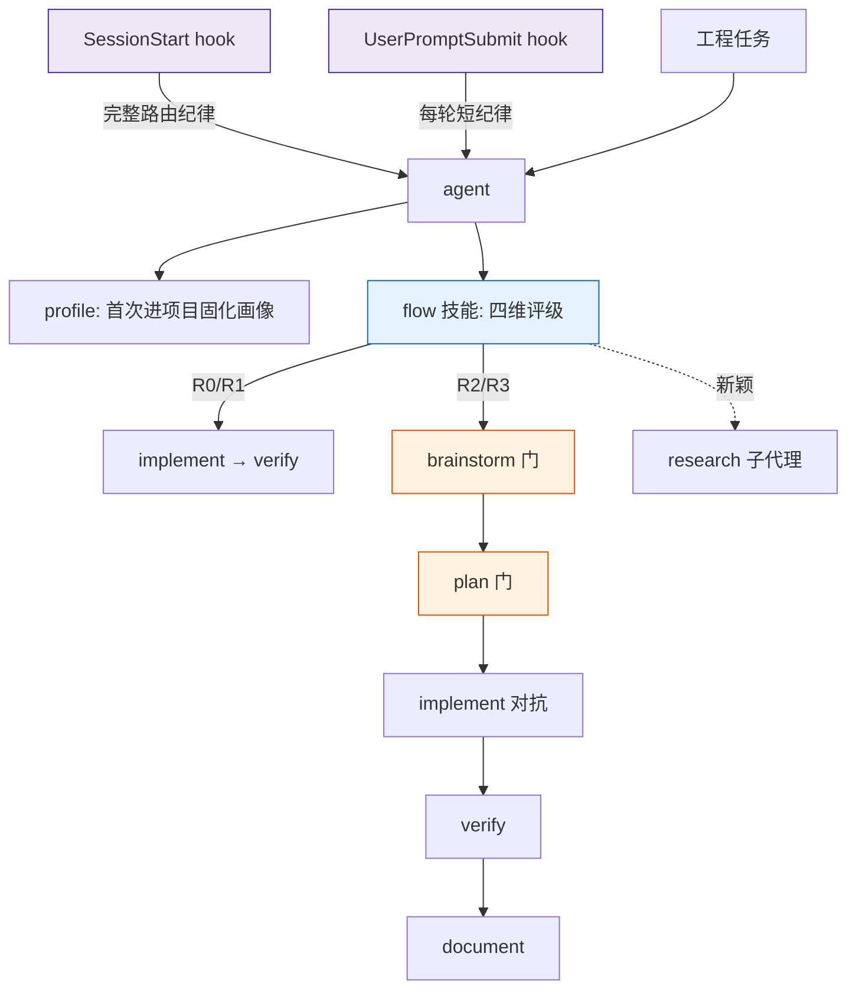
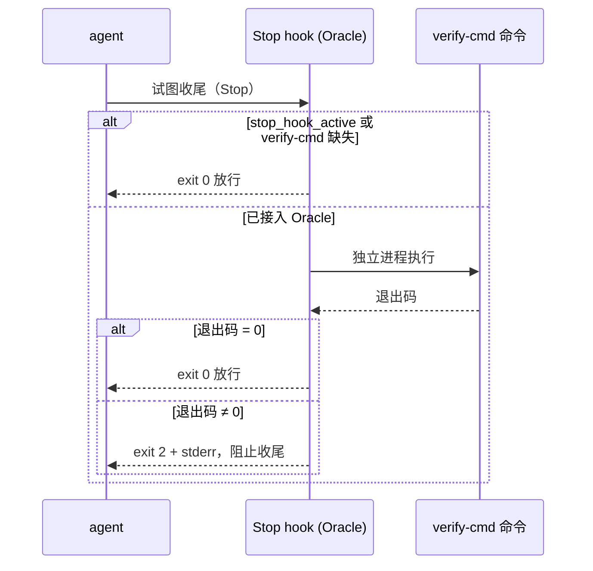

# Flow 设计文档

## 1. 概述

Flow 是一个工程工作流插件，把「按复杂度选择流程深度、完成须附验证证据」固化为一组原生 Claude Code 技能，并以三支 hook 提供机制兜底。运行时由两类组件构成：

- **三支 hook**——`SessionStart`、`UserPromptSubmit`、`Stop`，分别负责注入路由纪律、对抗上下文衰减、独立裁决完成。
- **一组按需加载的技能**——评级与各流程能力以 `SKILL.md` 提供，由 agent 通过原生 `Skill`、`Task`、`TodoWrite` 与 plan mode 编排。

除三支 hook 外不引入任何常驻进程或命令行工具。唯一的持久状态是项目接入 Oracle 时写入的 `docs/flow/verify-cmd`，opt-in 且可随时删除。

## 2. 设计目标

Flow 针对 Claude Code 项目级开发的四类痛点，各落一条机制；并补上多数框架忽视的「完成由独立 Oracle 裁决」。

| 痛点 | 机制 | 载体 |
|---|---|---|
| 能力衰减：靠人记得触发流程，注意力一漂质量就掉 | 路由纪律由 hook 每轮重注入，不随上下文增长被挤出 | `flow-bootstrap.sh` + `flow-reinject.sh` |
| 上下文污染：大量技能与仪式常驻主上下文 | 技能正文按需加载；重活派子代理、只回传蒸馏结果 | 技能契约（§6）+ `research`/`brainstorm`/`plan` |
| 经验不沉淀：踩过的坑散落各次会话 | 学习信号蒸馏成经验，写入项目 `lessons/` / `CLAUDE.md` | `harvest` |
| 规范一刀切：通用流程不懂「这个项目」 | 项目画像把命令、风格、反模式特化到代码库 | `profile` + `docs/flow/project.md` |
| 完成自说自话：agent 自评通过 | 完成由独立进程跑真实验证命令裁决 | `flow-oracle.sh` + `docs/flow/verify-cmd` |

## 3. 组成

| 组件 | 路径 | 职责 |
|---|---|---|
| 引导 hook | `hooks/flow-bootstrap.sh` | `SessionStart` 输出一行 `additionalContext` JSON，注入完整路由纪律 |
| 重注入 hook | `hooks/flow-reinject.sh` | `UserPromptSubmit` 每轮注入一句短纪律；命中 `#skip-flow` 静默放行 |
| Oracle hook | `hooks/flow-oracle.sh` | `Stop` 时以独立进程跑 `docs/flow/verify-cmd`，失败即 `exit 2` + stderr 打回 |
| hook 声明 | `hooks/hooks.json` | 注册上述三支 hook |
| 总路由技能 | `skills/flow/SKILL.md` | 评级 rubric、档位流程映射、质量红线、升维规则 |
| 画像技能 | `skills/profile/SKILL.md` | 探测并固化项目画像到 `docs/flow/project.md` + `verify-cmd` |
| 流程技能 | `skills/<name>/SKILL.md` | brainstorm / plan / implement / verify / research / diagram / document / harvest / writing-skills |
| 反模式目录 | `skills/implement/references/antipatterns.md` | verifier 对照扫描的反模式清单 |

技能元数据仅含 `name` 与 `description`，由 Claude Code 自动发现，无注册表。`docs/flow/` 下的 `project.md`（画像）与 `verify-cmd`（Oracle 燃料）是运行时产物，非插件自带配置。

## 4. 控制流

技能编排：

会话开始时 `SessionStart` hook 注入完整路由纪律，并在 `compact` 与 `clear` 后重注入；`UserPromptSubmit` hook 在每轮用户提交时补注一句短纪律，填补会话内上下文增长导致 `SessionStart` 提示被埋没的窗口。agent 收到工程任务后先加载 `flow` 技能评级，再按档位逐步加载流程技能；每支技能仅在加载时进入主上下文。

完成门控（`Stop` hook Oracle）：

## 5. 复杂度路由

评级维度为影响面、不可逆性、未知度、风险，各取 0–3，求和映射档位：

| 总分 | 档位 | 流程 |
|---|---|---|
| 0–1 | R0 | implement → verify（冒烟） |
| 2–4 | R1 | implement（TDD）→ verify（单测）→ 简要交付 |
| 5–8 | R2 | research → brainstorm（门）→ plan（门）→ implement（对抗）→ verify（单测+集成）→ document |
| 9–12 | R3 | 同 R2，多 change、各自 worktree、双门把关 |

档位在单个任务内判定一次并沿用。覆盖标记：`#R0`–`#R3` 强制，`#skip-flow` 跳过，`#new` 重新评级。

## 6. 完成判定

完成由项目真实验证命令的新鲜输出裁决，分两级保证。

**验证命令的确定**（可靠性递降）：优先取 `docs/flow/project.md`（`profile` 固化）；缺失则 `verify` 现场探测，CI 配置 > 包/构建清单 > 代码采样。降级规则：无 CI 用清单推断；无测试退化为 build + lint；无可用构建则判定为不可自动验证，退回人工确认。验证深度随档位递增：R0 冒烟、R1 单测、R2 单测+集成、R3 增关键路径 E2E。

**两级保证**：

1. **纪律级**——红线表 + builder/verifier 角色分离，agent 自带证据声明完成。
2. **机器级**——`Stop` hook 独立 Oracle。项目写入 `docs/flow/verify-cmd` 后即接入：agent 每次收尾时该 hook 以独立进程跑这条命令，退出码非 0 时以 `exit 2` 阻止收尾、把失败输出经 stderr 回灌，agent 无法绕过。命中 `stop_hook_active` 时放行以免死循环；文件缺失时放行（零侵入），退回纯纪律级。

Oracle 采用 Stop hook 的 `exit 2 + stderr` 契约而非 `decision: block` 的 JSON 输出：stderr 可承载任意字节（引号、换行、ANSI 着色），无需对验证命令的原始输出做 JSON 字符串转义。

## 7. 技能契约

- 元数据仅 `name`（须等于目录名）与 `description`（仅触发条件，前置可检索症状，不含工作流步骤）。
- 正文按需加载，保持密集；超过 100 行的参考拆入 `skills/<name>/references/`。
- 行为塑造类技能须含「合理化 → 规则」红线表，逐条钉死可观察到的绕过借口。
- 技能间交接以正文显式声明下一步技能，不依赖外部调度器。

### 质量红线

1. 诚实：不得删除或弱化测试、修改断言以使其通过；不确定显式标注；完成声明须附同轮新鲜验证输出。
2. 权责分离：builder 与 verifier 为独立子代理；实现者不得修改测试、断言或 CI 配置。
3. 对抗：实现完成不等于通过；由独立 verifier 默认怀疑、专攻边界与错误路径证伪。
4. 主动穷尽：R0/R1 先执行后确认，R2/R3 在门处先确认后执行；修复一处缺陷时排查同模块同类缺陷。
5. 产物纪律：交付物只含结论与取舍；执行过程记录不作为交付文档。

### 升维规则

同一问题连续失败时逐级提升处理策略，不在首次失败触发：

| 连败 | 策略 |
|---|---|
| 1 | 重读上一次错误输出 |
| 2 | 换一个根本不同的分析视角 |
| 3 | 搜完整错误并读相关源码，列 3 个根本不同假设逐一验证 |
| 4 | 抛弃假设，构造最小复现，重列 3 个新假设 |
| 5+ | 隔离 PoC / 换技术栈；仍不收敛则质疑需求并结构化移交 |

同一批文件连续多轮修改而不收敛时，强制回到根因并提出反向假设。

## 8. 运行时产物与边界

- `docs/flow/project.md`——项目画像，由 `profile` 维护，供 `verify`/`implement` 读取。
- `docs/flow/verify-cmd`——Oracle 的验证命令（单行），是唯一的持久状态；opt-in，缺失即 Oracle 放行，可随时删除。
- `docs/flow/<change>/`——单个 change 的 context / design / tasks / research 工件。
- 经验沉淀写入项目 `lessons/` 或 `CLAUDE.md`，由原生上下文加载召回，无独立召回引擎。
- Oracle 在每次 `Stop` 执行完整 `verify-cmd`，对大型测试集有成本——故严格 opt-in，命令可按需收窄。
- 需要更强的外部循环（独立进程持续驱动验证）时，可与本 Oracle 正交叠加。
