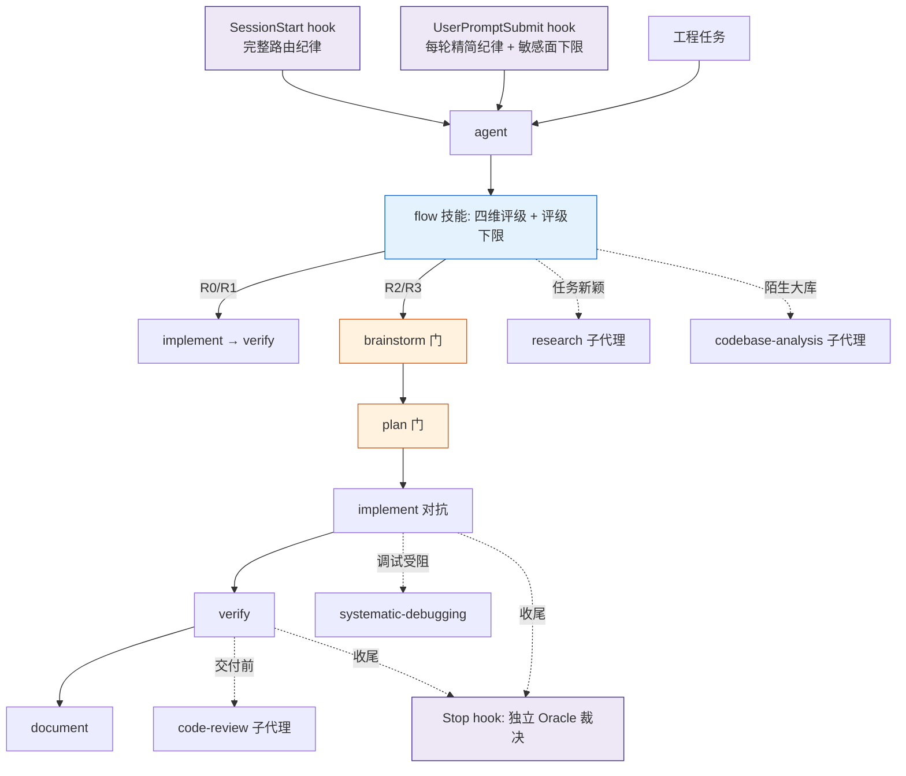
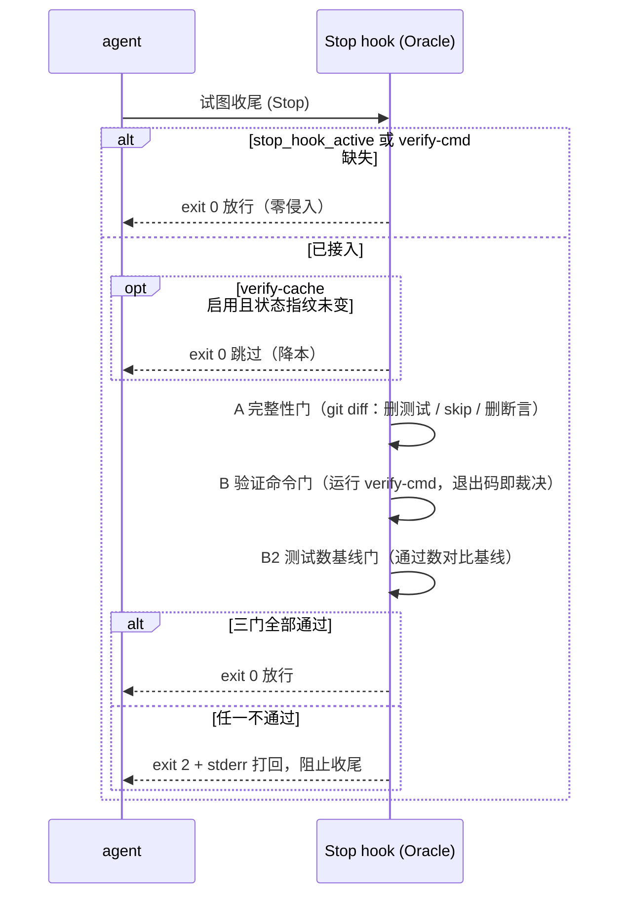

# Flow Harness 团队技术概览

## 摘要

Flow Harness（下称 Flow）是一个 Claude Code 插件，用于约束 AI 编码代理（agent）的工程行为。其核心机制为两点：其一，在执行任何工程任务之前，先依据复杂度评级（R0–R3）选择相应深度的流程；其二，在代理声明任务"完成"时，由一个与代理无关的独立进程运行项目的真实验证命令予以裁决，而非采信代理的自我宣告。

本文面向团队成员，依次说明 Flow 的背景动机、所解决的问题、提供的能力、系统架构、稳定性保障机制及使用方式。架构层面的技术细节参见 [`DESIGN.md`](DESIGN.md)，逐项操作说明参见 [`MANUAL.md`](MANUAL.md)。

---

## 1. 背景与动机

在使用 AI 编码代理进行项目级开发时，存在一组反复出现的失效模式，且这些失效会随代理上下文的增长而加剧：

- **缺乏与任务复杂度匹配的流程粒度。** 代理对"修正拼写错误"与"重构鉴权模块"采用相同的行为模式，导致简单任务被附加冗余流程，或复杂任务在缺乏方向对齐的情况下直接推进至错误方向。
- **"完成"依赖代理自我宣告。** 代理声明"应无问题"或"已修复"，但缺乏对验证命令的实际执行记录。在以"通过测试"为目标的压力下，代理可能删除失败的测试、注入 `.skip` 标记或将断言改写为恒真表达式（此类行为统称为 reward-hacking），从而在测试"变绿"的同时使质量保障失效。
- **流程纪律依赖人工记忆触发。** 即便工作流已书面化，随着代理上下文增长，会话开头注入的纪律提示会被逐渐淹没，导致流程实际上不被执行。
- **通用流程缺乏对具体项目的认知。** 代理不掌握项目真实的测试命令、代码风格约定及历史经验，只能套用泛化规范。
- **复杂度评级可被压低。** 代理在自评复杂度时存在压低评分以跳过流程的动机，且此种倾向在迁移、鉴权、支付等最不应跳过流程的场景中尤为突出。

Flow 的设计立场是：上述失效不能依赖代理的"自律"消除，须由机制层面的强制约束予以兜底。每一类失效对应一条强制机制。

---

## 2. 所解决的问题

| 失效模式 | 对应机制 |
|---|---|
| 流程纪律依赖人工记忆，随上下文增长而失效 | 路由纪律由 hook 在每轮交互中重新注入，不随上下文增长被淹没 |
| 大量技能与流程常驻上下文，增加开销 | 技能正文按需加载；重负载任务派发至子代理，仅回传蒸馏后的结论 |
| "完成"自我宣告，可通过弱化测试达成 | 由独立进程运行真实验证命令裁决"完成"，并扫描 git diff 以拦截弱化测试的改动 |
| 通用流程缺乏对具体项目的认知 | 项目画像将真实命令、风格约定与反模式特化至具体代码库 |
| 历史经验散落于各次会话 | 学习信号经蒸馏为可复用经验，写入项目的 `lessons/` 或 `CLAUDE.md` |
| 复杂度评级被压低以跳过流程 | 任务触及敏感面（迁移、鉴权、支付、生产数据等）时，评级设有下限（≥ R2） |

---

## 3. 提供的能力

Flow 的全部能力以原生 Claude Code 技能（`SKILL.md`）形式提供，按需自动加载，通常无须人工调用。现有 18 支技能，按职能分为五类。

**总路由**

- `flow` —— 复杂度评级、流程选择、质量红线、升维规则与评级下限的统一入口。

**项目理解（只读；四者职责互斥）**

- `profile` —— 探测并固化项目真实的 test/build/lint 命令、风格约定与反模式，产出 `docs/flow/project.md`，并据此接入下文所述的 Oracle 门控。
- `codebase-analysis` —— 针对陌生或大型代码库生成内部结构"代码地图"，产出 `docs/flow/codemap.md`。
- `impact-analysis` —— 在变更前计算其波及面（受影响文件、应运行的测试范围、高风险点）。
- `tech-debt-audit` —— 依据 churn×complexity 定位技术债热点，每条发现附 `file:line`，产出 `TECH_DEBT_AUDIT.md`。

**调研与对齐**

- `research` —— 派发子代理进行 fan-out 外部调研，仅回传带引用的结论；高风险决策升至"深档"，附对抗证伪回环与引用完整性校验硬门。
- `brainstorm` —— 方向对齐（硬门，需使用者明确确认方可推进），承担规格澄清职能。
- `plan` —— 将既定方向落实为可执行设计与任务拆解（门），进门后不再发散。

**实现与验证**

- `implement` —— builder 负责实现，独立的 verifier 子代理负责对抗证伪，二者角色不得合并。
- `systematic-debugging` —— 四阶段根因调试（复现 → 根因 → 最小修复 → 防回归），未定位根因不得提交修复。
- `verify` —— 定位并运行项目真实验证命令，附新鲜输出作为证据。
- `code-review` —— 派发独立 reviewer 子代理，按 Critical/Important/Minor 分级评审。
- `subagent-driven-development` —— 将任务列表逐条派发至全新子代理，配合双重评审与按难度分配模型。

**交付与收尾**

- `diagram` —— 生成可渲染的 Mermaid 图。
- `document` —— 生成面向人类的交付物（结论、设计取舍与图），不含执行过程流水账。
- `finishing-a-development-branch` —— 合并、提交 PR 或丢弃分支的决策流程，收尾前须通过 verify 与 Oracle。
- `harvest` —— 将一次真实的学习信号蒸馏为可复用经验。

**元能力**

- `writing-skills` —— 用于新增或修改 Flow 技能，对流程文档施加测试驱动开发（TDD）方法。

---

## 4. 系统架构

### 4.1 运行时组成

Flow 在运行时仅由两类组件构成，除三支 hook 外不引入任何常驻进程或命令行工具：

1. **三支 hook** —— 提供机制层兜底，构成代理无法绕过的硬约束。
2. **一组按需加载的技能** —— 提供各流程能力，由代理通过原生 `Skill`、`Task`、`TodoWrite` 及 plan mode 进行编排。

持久状态仅为项目接入门控时写入 `docs/flow/` 目录的少量文件，全部为可选项（opt-in），可随时删除；删除后插件回归零侵入状态。

### 4.2 三支 hook（机制层）

| Hook | 触发时机 | 职责 | 所治失效 |
|---|---|---|---|
| `flow-bootstrap.sh` | `SessionStart`（含 startup、clear、compact） | 注入完整路由纪律；项目画像过期时附加提示 | 确保代理在执行前先行评级 |
| `flow-reinject.sh` | `UserPromptSubmit`（每轮交互） | 注入精简纪律；命中敏感面关键词时叠加评级下限提示；`#skip-flow` 时静默放行 | 对抗上下文衰减；防止评级被压低 |
| `flow-oracle.sh` | `Stop`（代理试图收尾时） | 以独立进程运行三道门裁决"完成"，失败时以 `exit 2` 打回 | 防止自我宣告完成与弱化测试 |

### 4.3 控制流



### 4.4 复杂度路由

评级采用四个维度，各取 0–3 分，求和后映射至档位。验证深度随档位递增。

| 维度 | 0 | 1 | 2 | 3 |
|---|---|---|---|---|
| 影响面 | 单文件 | 单模块 | 多模块 | 跨系统 |
| 不可逆性 | 一键回滚 | 易回滚 | 难回滚 | 不可逆 / 生产数据 |
| 未知度 | 完全已知 | 小幅不确定 | 需调研 | 需全新方案 |
| 风险 | 无副作用 | 内部副作用 | 外部副作用 | 安全 / 数据 / 合规 |

| 总分 | 档位 | 流程 | 验证深度 |
|---|---|---|---|
| 0–1 | R0（直接执行） | implement → verify | 冒烟 |
| 2–4 | R1（轻流程） | implement（TDD）→ verify → 简要交付 | 单元测试 |
| 5–8 | R2（标准） | research（若新颖）→ brainstorm（门）→ plan（门）→ implement（对抗）→ verify → document | 单元测试 + 集成测试 |
| 9–12 | R3（项目） | 同 R2，并拆分多 change、各自隔离 worktree、双门把关 | 增关键路径 E2E |

档位在单个任务内评定一次并沿用。覆盖标记：`#R0`–`#R3` 强制指定档位，`#skip-flow` 跳过流程，`#new` 重新评级。

---

## 5. 稳定性保障机制

Flow 的稳定性源于若干明确的工程取舍，而非实现层面的细致程度。

### 5.1 完成判定的两级保证

| 级别 | 保证主体 | 约束强度 |
|---|---|---|
| 纪律级 | 质量红线与 builder/verifier 角色分离，代理自带证据声明完成 | 软约束 |
| 机器级 | `Stop` hook 独立 Oracle，以独立进程运行真实命令裁决 | 代理无法绕过 |

机器级 Oracle 是 Flow 区别于基于提示词的工作流的核心。项目写入 `docs/flow/verify-cmd`（单行验证命令，如 `npm test`）后即接入；此后每次收尾运行三道门：



- **A 完整性门（语法层）** —— 仅在 git 仓库内生效。扫描工作树相对 HEAD 的改动，拦截以下行为：净增 skip/only/todo/xit/`#[ignore]` 标记、断言净减少、删除测试文件、测试文件被 `assume-unchanged`/`skip-worktree` 隐藏、verify-cmd 自篡改。
- **B 验证命令门** —— 运行 verify-cmd，退出码即裁决；失败时将输出末 40 行经 stderr 回灌至代理以供继续修复。
- **B2 测试数基线门（语义层）** —— 解析 runner 输出的通过数（多 suite 求和），低于 `docs/flow/test-count` 即打回，用于捕获语法层无法识别的测试数下降。首次通过时建立基线。

### 5.2 关键工程取舍

- **零侵入与严格 opt-in。** 未写入 `verify-cmd` 时 Oracle 直接放行；删除 `docs/flow/` 后插件回归纯纪律级。门控始终为附加项，而非默认拦截。
- **fail-safe-to-run。** 非 git 环境、无法解析测试数、无法计算指纹等情形，一律降级放行而非误门控，以避免错误阻断正常收尾。
- **`exit 2 + stderr` 契约。** 失败原因经 stderr 而非 JSON 传递，使其可承载任意字节（引号、换行、ANSI 序列），免去对原始命令输出进行 JSON 转义的脆弱环节。
- **防死循环。** 命中 `stop_hook_active` 时立即放行。
- **无强依赖。** 仅依赖 POSIX `sh`、`grep`、`sed`、`git`，不依赖 `jq`；grep 模式不使用 `\b`，兼容 BSD/macOS grep。
- **正当操作的显式豁免通道。** 确需删改测试时，提交 `docs/flow/verify-allow-test-changes`（须已提交方生效，保留审计痕迹）；测试集规模较大、收尾验证耗时较长时，启用 `docs/flow/verify-cache`，在自上次通过以来状态未变时跳过验证。

### 5.3 威胁模型与边界

Flow 明确声明：门控的定位是"提高绕过成本并保留审计痕迹"的纪律门，而非沙箱级隔离。已知绕过边界（须配合覆盖率/变异测试及人工评审方可根治）如下：

- **同数语义掏空。** 删除真实断言的同时加入等量恒真断言，测试数不变，B2 无法识别，须依赖覆盖率或变异测试。
- **verify-cmd 间接层。** 当 verify-cmd 形如 `sh run.sh` 时，修改未提交的 `run.sh` 可绕过门控；建议验证命令自包含，或将其依赖脚本一并提交。
- **具备提交权限的对抗。** 可提交弱化后的改动以绕过门控；代理亦可覆写 Oracle 或基线文件本身。

据此，使门控可信的关键操作为：将 `docs/flow/` 下的 `verify-cmd`、`test-count`、`verify-allow-test-changes` 纳入版本控制，并在评审时关注其变更。

### 5.4 质量红线

全部技能继承统一红线：① 不得删除或弱化测试、改写断言以达成"变绿"，完成声明须附同轮新鲜输出；② builder 与 verifier 为独立子代理，实现者不得修改测试、断言或 CI 配置；③ "实现完成"不等同于"通过"，须由独立 verifier 对抗证伪；④ R0/R1 先执行后确认，R2/R3 在门处先确认后执行，修复一处缺陷须顺查同类；⑤ 交付物仅含结论与取舍，执行过程流水账不作为交付文档。

### 5.5 框架自身的工程纪律

Flow 自身亦遵循同等工程纪律：hook 配有 `*.test.sh` 自检脚本，历史经验沉淀于 `lessons/`（如解析重复输出须求和而非取末行、shell 关键词匹配须折叠大小写、插件 manifest 不得重复声明 hook 等）。

---

## 6. 使用方式

### 6.1 安装

```
/plugin marketplace add owenhu-cloud/flow-harness
/plugin install flow@flow-harness
```

安装后即生效，无须逐项目配置。可通过 `claude plugin list` 确认 `flow@flow-harness` 状态为 `✔ enabled`。

### 6.2 日常使用

使用者按常规方式提出需求即可。对每个工程任务，代理将自动执行：

1. **复杂度评级**，并以一句话告知结果，例如："此任务为 R2（影响面 2 / 不可逆 1 / 未知 2 / 风险 2 = 7），流程为 brainstorm → plan → 门 → implement → verify → document"。
2. **按档位执行流程**（见 §4.4）。R2/R3 将在 brainstorm 方向门与 plan 设计门处暂停，等待使用者确认，以避免大型变更在缺乏对齐的情况下推进至错误方向。
3. **完成附带证据**，任何"完成/通过"声明均附同轮新鲜的 build/test 输出。

### 6.3 接入机器级门控（推荐）

1. 在项目首个任务中调用 `profile`，由其探测并写入 `docs/flow/project.md` 与 `docs/flow/verify-cmd`。
2. 此后代理每次收尾时，`Stop` hook 自动运行三道门裁决，代理无法绕过。
3. 将 `docs/flow/verify-cmd` 与 `docs/flow/test-count` 纳入版本控制，并在评审时关注其变更，以确保门控可信。

### 6.4 控制标记

控制标记写入交互消息即时生效。

| 标记 | 作用 |
|---|---|
| `#R0`–`#R3` | 强制指定档位（评级偏低导致漏流程、偏高导致空转时均可纠正） |
| `#skip-flow` | 本次不执行 Flow |
| `#new` | 对当前任务重新评级 |

### 6.5 常见操作

- **正当删除过时测试被门控打回。** 提交空文件 `docs/flow/verify-allow-test-changes`（须已提交方生效）。
- **测试集规模大、收尾验证耗时长。** 创建空文件 `docs/flow/verify-cache`；当测试依赖 `.gitignore` 文件（如 `.env`、fixtures）时不应启用，因状态指纹无法感知此类文件的变更。
- **Oracle 未生效。** 先确认插件状态为 `✔ enabled`，再确认存在非空的 `docs/flow/verify-cmd`；后者缺失时 Oracle 按设计放行。

### 6.6 运行时产物

下列产物均位于 `docs/flow/` 目录，为可选项，可随时删除。

| 文件 | 写入方 | 作用 |
|---|---|---|
| `project.md` | `profile` | 项目画像（命令、风格、反模式），供 verify、implement 读取 |
| `verify-cmd` | `profile` / `verify` | Oracle 的验证命令（单行），门控接入开关 |
| `test-count` | Oracle | B2 基线（整数），建议提交并人工评审 |
| `verify-allow-test-changes` | 使用者 | 测试增删豁免标记（须已提交方生效） |
| `verify-cache` 与 `.last-green` | 使用者 / Oracle | 降本开关与状态指纹（`.last-green` 不应提交共享） |
| `<change>/` | 各技能 | 单个 change 的 context、design、tasks、impact 等工件 |

---

## 7. 总结

Flow 将"按复杂度选择流程深度"与"完成须附独立验证证据"两项在 AI 辅助开发中最易失效的环节，从依赖代理自律转变为依赖 hook 机制兜底：简单任务不附加冗余流程，复杂任务受流程纪律约束，完成由独立进程裁决，且整套机制零侵入、可随时退出。对团队而言，其核心价值在于：将验证命令与测试基线纳入版本控制后，"代理声明完成"这一陈述首次具备了机器可核验性。
