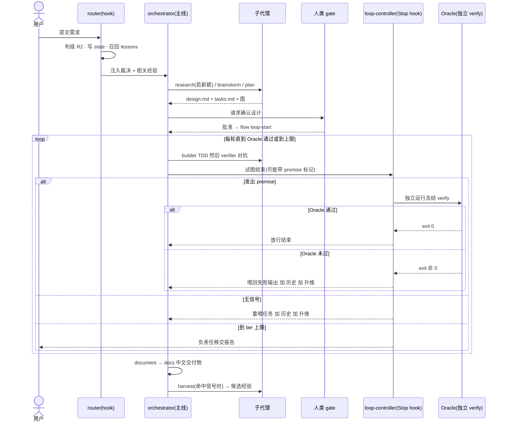
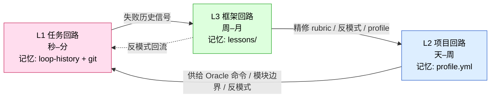

> [Flow 技术设计](../Flow-技术设计.md) · 第一章 / 共七章

# 一、背景与设计哲学

## 1. 背景与目标

在 Claude Code 上做项目级开发，存在四类痛点：

- **能力衰减**：靠人记得手动触发流程，注意力一漂质量就掉。
- **上下文污染**：把大量 skill 与仪式常驻主上下文，注意力被稀释，重流程拖慢一切。
- **经验不沉淀**：踩过的坑、做对的判断散落在一次次会话里，下次从零再来。
- **规范一刀切**：通用流程框架不懂"这个项目"——用错测试命令、套错代码风格、扫错反模式。

Flow 针对这四点给出对应机制：流程触发由 hook 每轮重注入，不随上下文增长被挤出（治衰减）；重活在子代理完成、只回传蒸馏结果（治污染）；学习闭环把失败信号蒸馏成经验（治不沉淀）；项目画像把规范特化到代码库（治一刀切）。

并补上一条多数框架忽视的能力：**让"完成"由独立 Oracle 裁决，而非 agent 自说自话**——这是质量不靠自律、靠机制的根本。

### 设计参照

Flow 借鉴了若干成熟思想，并将其合并、精简、塞进子代理执行：规格即真源的文件模型（specs + changes + propose/apply/archive 生命周期）；技能的渐进式披露与词数预算；由独立验证函数关闭"自评自批"漏洞的执行闭环；以及把失败应对结构化为认知升维而非情绪施压。Flow 不使用任何施压/情绪话术，只取其工程结构。

---

## 2. 一个任务怎么走（R2 端到端）

先看一个标准复杂度（R2）任务在 Flow 里的完整路径，再进抽象。

关键点：思考与设计阶段产出**文件**（design/tasks），人审产物而非审议过程；实现阶段进入 Oracle 闭环，agent 物理上无法"嘴上说完成"——它发 `<promise>`，hook 在上下文外独立跑验证命令裁决；循环默认有界，到上限负责任移交，不无限烧。

---

## 3. 设计哲学：三层嵌套反馈回路

Flow 不是一串流水线，而是一个带三层反馈、跨时间尺度的控制系统。每层是一个回路，各有收敛目标与记忆载体，三者互锁。

| 回路 | 时间尺度 | 机制 | 收敛目标 | 记忆载体 |
|---|---|---|---|---|
| **L1 任务回路** | 秒–分 | Oracle 闭环（Stop hook 驱动、按 tier 有界） | 单个任务收敛到"被独立验证通过" | `loop-history.jsonl` + git |
| **L2 项目回路** | 天–周 | 项目画像自举 + 校正 | 把通用规范特化到本项目 | `profile.yml` |
| **L3 框架回路** | 周–月 | 经验捕获 → 晋升 → 固化 | 让 rubric / 反模式 / 契约越用越准 | `lessons/` |

由此得到 Flow 对"自适应规范"的定义：

> **规范 = 通用契约 × 项目画像 × 累积经验。**
> 契约通用不变；画像与经验逐项目、逐时间特化。

---

← 总览：[Flow 技术设计](../Flow-技术设计.md) ｜ 下一章：[二、架构与路由](02-架构与路由.md)
