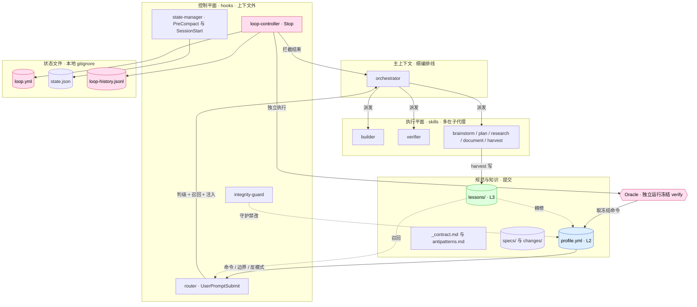

> [Flow 技术设计](../Flow-技术设计.md) · 第二章 / 共七章

# 二、架构与路由

## 4. 总体架构

Flow 分为**控制平面**（hooks，运行在主上下文之外，常驻极小）与**执行平面**（skills，多在子代理）。主上下文只保留一根细的编排线 + 各阶段蒸馏结果 + Oracle 输出。

**为什么强制循环不污染主上下文**：循环逻辑活在 hook（控制平面），builder/verifier 活在子代理（执行平面），Oracle 在 hook 外独立运行。主上下文每轮只增量持有循环状态摘要、蒸馏后的迭代结果与 Oracle 输出。重活不回灌主上下文。

层次速览：①控制层（Kernel/hooks，§6）；②方法论层（skills，§8）；③状态层（OpenSpec 文件模型，§13）；④质量层（契约，§9）；⑤项目自适应层（profile，§10）；⑥学习层（lessons，§11）；⑦观测层（§15）。

---

## 5. 复杂度路由

### 5.1 判级 rubric

四维各 0–3 打分求和 → tier，越重分越高：

| 维度 | 0 | 1 | 2 | 3 |
|---|---|---|---|---|
| 影响面 | 单文件 | 单模块 | 多模块 | 跨系统 |
| 不可逆性 | 一键回滚 | 易回滚 | 难回滚 | 不可逆 / 触线上数据 |
| 未知度 | 完全已知 | 小不确定 | 需小调研 | 需调研新方案 |
| 风险 | 无副作用 | 内部副作用 | 外部副作用 | 安全 / 数据 / 合规 |

"影响面"的模块粒度由 `profile.yml` 的 `module_boundaries` 定义——这是规范自适应的体现。阈值见 `config.yml`（`route.R0.max_score` 等）。

### 5.2 总分 → tier → 流程 → 循环预算

| 总分 | Tier | 流程 | L1 循环 | 迭代上限 |
|---|---|---|---|---|
| 0–1 | **R0 直执** | implement → self-test（冒烟） | 关 | — |
| 2–4 | **R1 轻流程** | (brainstorm/plan 内联) → implement(TDD) → self-test(单测) → 简要 doc | 开 | 5 |
| 5–8 | **R2 标准** | research(按需) → brainstorm → plan(+图) → gate → implement(对抗) → self-test(单测+集成) → document | 开 | 10 |
| 9–12 | **R3 项目** | 规格拆多 change，每 change（独立工作目录/worktree）走 R2；顶层编排；双 gate | 每 change 开 | 10 |

**tier 黏滞**：一个 run 内任务边界判一次级，中途消息（"继续""改这里"）沿用，避免抖动与"agent 给自己任务反复打分"的自评污染。

**人工覆盖**：消息含 `#R0`–`#R3` 强制 tier · `#skip-flow` 本轮跳过 · `#new` 重判 · `#no-loop` 关闭本次循环退回人类确认 · `#downgrade` 整 run 降级。覆盖优先于 rubric。

---

← 上一章：[一、背景与设计哲学](01-背景与设计哲学.md) ｜ 下一章：[三、Oracle 闭环与控制平面](03-Oracle闭环与控制平面.md)
