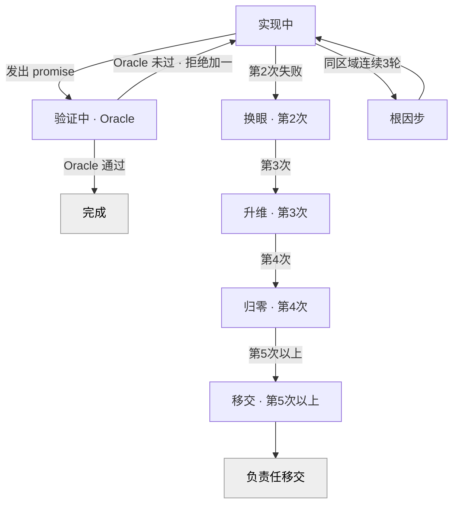

> [Flow 技术设计](../Flow-技术设计.md) · 第三章 / 共七章

# 三、Oracle 闭环与控制平面

## 6. Flow Kernel：控制平面

Kernel 是一组运行在主上下文外的 shell 脚本，四个清晰职责，注册在四个 hook 上。

| Hook | 脚本 | 职责 |
|---|---|---|
| UserPromptSubmit | `router.sh` | 判级 / 沿用黏滞 tier + 召回 lessons + 注入裁决 |
| Stop | `loop-controller.sh` | **L1 Oracle 闭环引擎**（核心，见 §7） |
| PreCompact | `checkpoint.sh` | 压缩前把 run 状态落盘 |
| SessionStart | `restore.sh` | 新会话注入续连提示 |

共享库 `lib.sh`（cwd 哈希、扁平点号键读写、可移植超时、transcript 解析）；自测 `selftest.sh`；CLI `bin/flow`。

**router**：注入约 5 行 rubric 让主 agent 自判（或外置 haiku 判级〔路线图〕）；从 `state.json` 读黏滞 tier；按当前任务关键词从 `lessons/` 召回 top-k 注入。非任务消息 / `#skip-flow` → 零注入零开销。

**state-manager**：`checkpoint.sh` 在压缩前把 `tier / iteration / active_loop / change_id` 等镜像进 `state.json`；`restore.sh` 在新会话开场注入一句状态恢复，使长任务跨压缩/跨会话不丢上下文（绑定 run 生命周期，非定时硬过期）。

**integrity-guard**：结构化实现"禁改判据"。MVP 已落地的是**来源限制**——Oracle 的验证命令只能来自人审过的 `profile.yml`，不在循环中由 agent 自造（也由此关闭"verify 跑任意字符串"风险）。主动检测"对测试/CI/profile 的改动并拦截"为〔路线图〕。

`bin/flow` 是编排者显式调用的 CLI：

```
flow tier <R0|R1|R2|R3> [--change <id>] [--next "假设"]
flow loop-start --change <id> --tier <R> [--verify "cmd"] [--promise TAG]
flow loop-stop | flow loop-status | flow profile-check
```

> `--verify` 仅供测试/特例旁路 profile；正常路径下 Oracle 一律由 profile 装配。

---

## 7. L1 任务回路：Oracle 闭环

### 7.1 机制

1. 设计通过 gate 后，编排者执行 `flow tier R2 --change <id>` 与 `flow loop-start --tier R2 --change <id>`。后者从 `profile.yml` 装配**冻结的** `verify_command`、按 tier 取迭代上限，写入 `loop.yml`。
2. builder 子代理（TDD）→ verifier 子代理（对抗）→ 试图结束本轮。
3. **Stop hook（loop-controller）拦截**，按优先级查信号 `abort > pause > promise`：
   - `<flow-abort>原因</flow-abort>` → 放行结束，删除循环。
   - `<flow-pause>` → 暂停（置 `active:false`），保留状态待续。
   - `<promise>FLOW_DONE</promise>` → 在 hook 外**独立运行 `verify_command`**（带超时）：退出码 0 则放行、删循环；非 0 则拒绝、`promise_rejections++`、把验证输出 + 历史 + 升维动作喂回。
   - 无终止信号 → 重喂任务 + 历史 + 升维动作。
   - 到迭代上限 → 负责任移交（§7.4）。
4. 每轮 append `loop-history.jsonl`（`iteration / status / oracle_exit / 时间戳`）。agent 每轮先读历史 + `git diff`，避免重复死路。

> promise 的载荷（默认 `FLOW_DONE`）可经 `config.yml` 的 `oracle.promise_tag` 配置。

无活跃循环时，Stop hook 一律放行——普通对话与非循环任务必须能正常结束。

### 7.2 Oracle 来源（连接 L2）

`verify_command` 由 `profile.yml` 的 `oracle.<tier>`（命令键的空格列表）× `commands.*` 装配：

| Tier | Oracle 默认组成 |
|---|---|
| R0 | build / 冒烟 |
| R1 | build + 单测 |
| R2 | build + 单测 + 集成 |
| R3 | 上述 + 关键路径 E2E |

**无 Oracle 不进循环**：若某 tier 在 profile 里装配不出验证命令，`loop-start` 拒绝，该任务退回人类确认，绝不退化成"信任 agent 自报"。

### 7.3 统一升维（去话术 · 由循环驱动）

升维模型由三要素构成：循环提供机制、认知层级提供动作内容、history 提供记忆。loop-controller 按 `max(iteration, promise_rejections)` 选层级注入：



| 层级 | 动作 |
|---|---|
| 稳步(1) | 逐字读上轮错误/验证输出再动手（**不升维**，避免触发良性迭代） |
| 换眼(2) | 换一个根本不同的分析视角 |
| 升维(3) | 系统全局：搜完整错误 + 读相关源码，列 3 个根本不同假设 |
| 归零(4) | 抛弃假设，构造最小复现，列 3 个新假设逐一验证 |
| 移交(5+) | PoC + 隔离环境 + 换栈；并质疑需求本身 |

**收敛停滞**：连续多轮改动同一批文件 → 强制根因步（列共享假设、提一个 180° 反向假设）。该检测基于工作树 `git diff` 文件签名。

### 7.4 有界与负责任移交

每 tier 有迭代上限（§5.2）。到上限 → 停循环，要求输出**结构化移交报告**：已验证事实 / 已排除可能 / 已收窄范围 / 建议方向 / 交接信息，浮给人类。这次移交连同 `loop-history` 满足学习信号，进入经验捕获（§11）。

---

← 上一章：[二、架构与路由](02-架构与路由.md) ｜ 下一章：[四、技能与质量契约](04-技能与质量契约.md)
