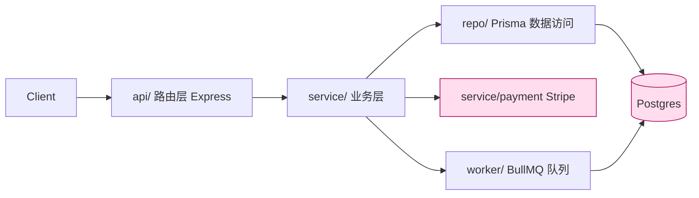

# codemap.md 完整示例（照此密度产出）

> 这是一份填满的 `docs/flow/codemap.md` 范例，场景：一个 TS + Express + Prisma 的订单服务。
> 用它对照自己的产出——**每个格子有证据、不臆测、查不实填「未确认」**。骨架与填法见 `codemap-template.md`。

```markdown
# 代码地图 (Flow)
> codebase-analysis 维护。plan 据此设计、implement 据此施工。每条断言挂证据；不臆测。
> 边界：只讲内部结构。命令/风格见 docs/flow/project.md(profile)；外部调研见 research。
## 元
- mapped_at: 2026-06-26   分区: api/ service/ repo/ worker/ shared/   覆盖: 全覆盖（migrations/ 仅扫表名未读逻辑）

## 1. 技术栈
| 维度 | 取值 | 证据 |
|---|---|---|
| 语言/版本 | TypeScript 5.4 | package.json, tsconfig.json |
| 框架/运行时 | Express 4 on Node 20 | package.json deps, src/app.ts:1-20 |
| 数据/存储 | Postgres via Prisma 5 | prisma/schema.prisma, src/repo/db.ts:8 |
| 异步/队列 | BullMQ + Redis | src/worker/queue.ts:1-30 |
| 关键依赖 | stripe（支付）, zod（校验） | package.json deps, src/service/payment.ts:3 |

## 2. 架构图 (Mermaid)


## 3. 模块职责
| 模块 | 职责 | 入口文件 | 不该有的（边界） |
|---|---|---|---|
| api/ | HTTP 路由、入参 zod 校验、鉴权中间件 | src/api/routes.ts:1 | 不写业务规则 |
| service/ | 订单/支付/结算业务规则 | src/service/order.ts:1 | 不直接拼 SQL |
| repo/ | Prisma 数据访问、事务 | src/repo/order.repo.ts:1 | 不含业务判断 |
| worker/ | 异步任务（发货、对账） | src/worker/index.ts:1 | 不被 api 同步调用 |
| shared/ | 错误类型、日志、配置 | src/shared/errors.ts | 无领域逻辑 |

## 4. 入口点
- HTTP 服务：`src/app.ts:34`（`app.listen`）
- 路由注册：`src/api/routes.ts:12`（`router.use('/orders', orderRouter)`）
- Worker：`src/worker/index.ts:9`（`new Worker('orders', ...)`）
- CLI/迁移：`package.json` scripts → `prisma migrate`

## 5. 一条主流程的生命周期：下单
1. `POST /orders` → `api/routes.ts:40` zod 校验
2. → `service/order.ts:createOrder():28` 校验库存+算价
3. → `service/payment.ts:charge():15` 调 Stripe（外部）
4. → `repo/order.repo.ts:insert():22` 事务落库
5. → 入队 `worker/queue.ts:enqueue():18`「发货」任务
6. 返回 201 + 订单号；发货异步在 worker 完成

## 6. 去哪找 X（查找表）
| 想改/找 | 去 |
|---|---|
| 加一个订单字段 | prisma/schema.prisma + repo/order.repo.ts + service/order.ts |
| 改支付逻辑 | service/payment.ts（Stripe 封装在此一处） |
| 加一个 HTTP 端点 | api/routes.ts 注册 + 对应 service/ |
| 错误码/异常 | shared/errors.ts |
| 异步任务 | worker/，队列名见 worker/queue.ts |
| 未确认：限流在哪 | 未确认（未见 rate-limit 中间件，疑在网关层，需 research/运维确认） |
```
