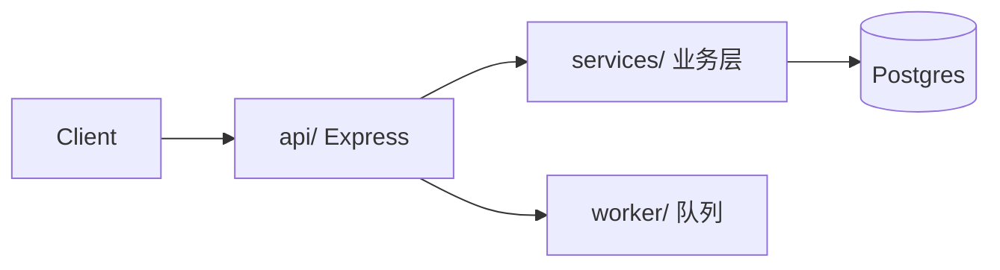

# codemap.md 模板与填法

主线程把各分区子代理回传的结构化制品缝成 `docs/flow/codemap.md`。固定六块骨架，全部带**证据列**；查不实的格子填「未确认」。结构化制品，非散文。

```markdown
# 代码地图 (Flow)
> codebase-analysis 维护。plan 据此设计、implement 据此施工。每条断言挂证据；不臆测。
> 边界：本文件只讲「内部结构是什么样」。命令/风格见 docs/flow/project.md(profile)；外部调研见 research。
## 元
- mapped_at: <日期>   分区: <如 api/ web/ worker/ shared/>   覆盖: <全覆盖 / 部分，未覆盖=…>

## 1. 技术栈
| 维度 | 取值 | 证据 |
|---|---|---|
| 语言/版本 | TypeScript 5.x | package.json, tsconfig.json |
| 框架/运行时 | Express on Node 20 | package.json deps, src/app.ts |
| 数据/存储 | Postgres via Prisma | prisma/schema.prisma |
| 关键依赖 | … | <manifest 路径> |

## 2. 架构图 (Mermaid)

> 只画已见证据的组件与依赖方向；没见过的边不画。

## 3. 模块职责表
| 模块 | 职责(一句) | 入口文件:符号 | 主要依赖 | 证据 |
|---|---|---|---|---|
| api | HTTP 路由与请求编排 | src/api/server.ts:start | services, auth | grep "app.use" |
| services | 核心业务逻辑 | src/services/index.ts | db, queue | — |
| worker | 异步任务消费 | src/worker/main.ts:main | queue, db | src/worker/main.ts |

## 4. 入口点
| 类型 | 位置(文件:符号) | 说明 |
|---|---|---|
| HTTP 进程 | src/api/server.ts:start | 监听 :3000 |
| CLI | src/cli.ts:main | 运维脚本入口 |
| Job/worker | src/worker/main.ts:main | 消费队列 |
| 定时任务 | 未确认 | grep cron/schedule 无命中 |

## 5. 一条主流程的生命周期
选一条代表性请求/主流程，从入口逐跳追到出口，每跳标 `文件:符号`：
1. 入口  `src/api/server.ts` → 路由 `routes/order.ts:createOrder`
2. 校验  `middleware/auth.ts:verify`
3. 业务  `services/order.ts:create` → 调 `services/payment.ts:charge`
4. 持久  `repo/order.ts:insert`（Prisma）
5. 出口  返回 201 / 推一条 `worker` 队列消息 `queue/order.ts:enqueue`
> 追不通的跳标「未确认（断点在 …）」，留给 plan 去查，不脑补。

## 6. 「去哪找 X」查找表
| 我想做 X | 去这里 | 证据 |
|---|---|---|
| 加一个 API 路由 | src/routes/*.ts，注册在 server.ts | grep "router." |
| 改数据模型 | prisma/schema.prisma + repo/ | — |
| 加一个后台任务 | src/worker/ + queue/ | src/worker/main.ts |
| 改鉴权 | middleware/auth.ts | — |
| 改配置/环境变量 | src/config/*.ts, .env.example | — |
```

## 填法要点

- **证据列不可空着**：要么是真实路径/grep 命中，要么是「未确认」。没有第三种。
- **架构图只画见过的**：组件与依赖方向都要有分区制品支撑；臆造的边比缺边更糟。
- **生命周期挑一条就够**：覆盖最有代表性的一条主链路即可，别铺所有路径——目的是让读者建立「请求怎么穿过系统」的心智模型。
- **查找表面向意图**：左列写 plan/implement 阶段会问的「我要做 X 该改哪」，右列给落点目录/文件。
- **薄而密**：能用表/图表达就不写段落；这是给 agent 快速建模用的地图，不是讲解文档。
