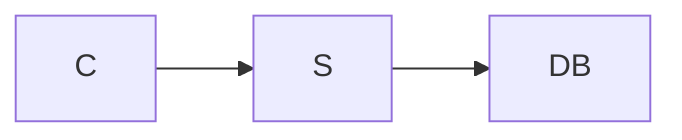
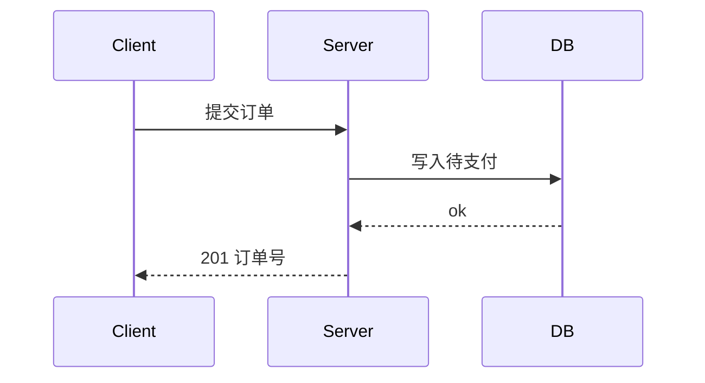

# diagram — 仅 Mermaid

**适用档位 R2+。** 在 brainstorm→plan→implement→verify→document 中，本技能被 `plan`（落架构/流程图）或 `document`（嵌关键图）按需调用；不独立成阶段。**产物只有 Mermaid 文本**，落 `docs/`，供人看。

## 铁律（iron-laws，违反即作废）

1. **只产 Mermaid 文本**——禁止图片/截图/ASCII art/PlantUML/draw.io 等任何其他格式。
2. **类型由「要表达什么」决定，不由「我更熟哪个」决定**（选错类型是最大丑因，映射见下表）。
3. **每张图必须语法可渲染**——未验证可渲染 = 未完成（见反 reward-hacking）。
4. **单图节点 ≤ ~12**，超则拆图；一张图只表达一个主题。

## 类型映射（先对症，再画）

| 要表达的东西 | 选 | 选错的典型 |
|---|---|---|
| 模块/服务依赖、分层架构 | `flowchart`（分层 `subgraph`） | 用它画跨组件时序 |
| 跨组件按时间顺序的交互、请求-响应、调用次序 | `sequenceDiagram` | 用 flowchart 硬画握手 |
| 对象的状态生命周期、有限状态机 | `stateDiagram-v2` | 用 flowchart 画状态 |
| 数据模型、实体关系、表结构 | `erDiagram` | 用 flowchart 画表 |
| 类/接口结构与继承 | `classDiagram` | 用 ER 画类 |
| 纯分支决策流程 | `flowchart`（判定菱形） | — |

判定口诀：**有「时间先后/生命线」就 sequence；有「状态迁移」就 state；有「实体+关系基数」就 ER；其余结构/依赖才 flowchart。** 决策树、完整反例集与全项目固定四色 `classDef` 调色板见 `references/type-selection.md`。

## 可读约束

- 统一方向（一图内只用一个 `TD` 或 `LR`）。
- **连线必带标签**——无标签连线 = 语义缺失。
- 关键路径用 `classDef` 高亮；颜色复用全项目固定四色（主/次/外部/告警），不每张图自创。
- 命名用领域词，不用 `A/B/C` 占位。

## 危险信号（出现即停 / 回退）

- 一张图里既想画架构又想画时序 → 拆成两张，各选对类型。
- 节点超 ~12 或连线交叉成网 → 拆图。
- 出现无标签连线、或 `A-->B` 这类占位命名 → 停下补语义。
- 想插入截图/ASCII/外链图 → 回到 Mermaid，铁律 §1。

## 反 reward-hacking（完成判定）

- 「脑补语法应该没错」「大概能渲染」**不算完成**——必须实际确认可渲染（贴进 Mermaid 渲染器，或 `mmdc`/`npx @mermaid-js/mermaid-cli` 跑通）。
- 不把「类型差不多、能看懂」当达标：类型映射不匹配即返工，不用同义近似类型蒙混。
- 渲染报错就如实修，不偷偷删掉报错的节点凑「渲染成功」。

## 正反例（最常见的错）

反例——用 flowchart 画三方握手（时序信息全丢，看不出谁先发）：

正例——交互按生命线还原时间顺序：

## checklist（产图前逐条过）

- [ ] 类型按「要表达什么」选对（对照映射表/决策树）
- [ ] 节点 ≤ ~12，单图单主题，方向统一
- [ ] 每条连线有标签，命名用领域词
- [ ] 关键路径用固定四色 `classDef` 高亮
- [ ] 已实际渲染通过（非脑补语法）
- [ ] 落 `docs/`，且全文只有 Mermaid，无图片/ASCII

## 交接

产图完成后**回到调用本技能的阶段**：来自 `plan` 则继续 plan 的 design+tasks；交付物嵌图则**下一步用 `Skill` 工具加载 `document`** 写人类交付物。

遵循 `flow` 技能的质量红线。
