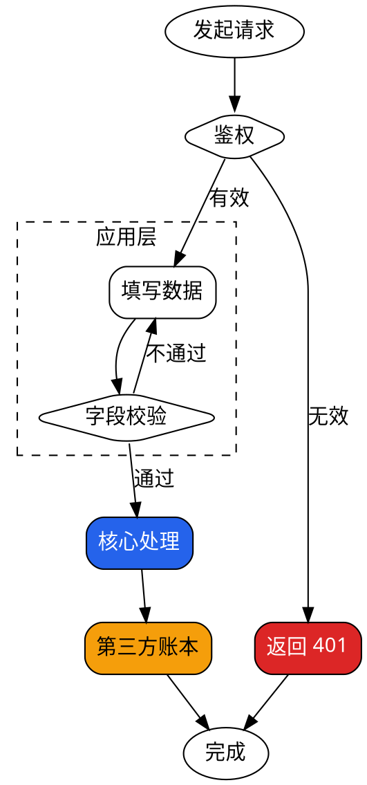

# Graphviz/DOT — 复杂流程/架构图后端

复杂流程图/架构图（命中 `type-selection.md` 复杂度触发判据、且拆不动）用 Graphviz/DOT。它对任意拓扑（回环、多错误回退、多汇聚）布局最紧凑、全边保真，而 Mermaid dagre 会拉成超长竖条。

## 何时用（recap）

任一命中且无法拆图：节点 >12 / 任意回环 / ≥3 错误回退边（1–2 条仍用 Mermaid）/ ≥3 分层 cluster / 边交叉成网。否则用 Mermaid（GitHub 内联）。**拆图永远是首选**，Graphviz 是拆不动的大流程的兜底——**选 Graphviz 前在图旁写一句「为何拆不动」**。

## 最小 DOT 骨架（照抄改名）


## 分层（cluster）+ 四色 + 回环/错误边（完整示例）

> 此示例可直接 `dot -Tsvg` 渲染（见文末渲染自检）。



四色语义（主#2563eb / 次#e5e7eb / 外部#f59e0b / 告警#dc2626）与 Mermaid 等价，定义见 `type-selection.md`。**焦点色（主/告警）≤2 处**。
> 标签约定：上例中**分支边**（`有效`/`无效`/`不通过`/`通过`）必带标签；**线性顺序边**（`Core->Ext`、`Ext->Done`、`AuthErr->Done`）先后已显然，可不标——符合主技能「分支/条件连线必带标签」的收窄规则。

## 布局调参（让复杂图更紧凑）

- **默认 spline 边已足够**：实测 33 节点流程不设 `splines` 即渲成紧凑全保真图。不要画蛇添足加 `splines=ortho`——它与「连线必带标签」冲突（Graphviz 报 `Orthogonal edges do not currently handle edge labels`，ortho 不生效）。确需正交且边有标签时改用 `xlabel`，否则保持默认。
- `rankdir=LR`：宽图改横向，避免超长竖条。
- `nodesep` / `ranksep`：调密度（默认偏松，0.3–0.5 更紧）。
- `subgraph cluster_xxx { label=...; style=dashed; }`：分层；**名必须 `cluster_` 前缀**，否则不画框。
- `shape`：起止 `oval`、决策 `diamond`、普通步骤 `box`（默认）。

## LLM 常见坑

- cluster 名漏 `cluster_` 前缀 → 框不画出来。
- 节点未先声明就在 `->` 里用 → 会被当默认样式新节点，丢掉你想要的 label/颜色；**先声明带样式的节点，再写连线**。
- 中文乱码 → `fontname` 按平台设（macOS `"PingFang SC"`、Linux `"Noto Sans CJK SC"`、Windows `"Microsoft YaHei"`）。
- `splines=ortho` 偶与 `label` 端口冲突报警告（不致命）；若布局怪异可退回默认 `splines=true`。
- 属性顺序：节点属性写在 `[]` 内分号分隔；`style="filled,rounded"` 要带引号（含逗号）。

## 渲染自检 + 落盘约定

```bash
dot -Tsvg x.dot -o x.svg     # 单二进制，免浏览器；报错即修语法，不删节点凑过
dot -Tpng x.dot -o x.png     # 需要位图时
```

- GitHub/Markdown **不内联渲染 DOT**：把渲染出的 `.svg` 内嵌进 doc，`.dot` 源一并提交。
- 二者同放引用它的 doc 的 `assets/`（如 `docs/<feature>/assets/flow.dot` + `flow.svg`）：源可 diff、SVG 可引用。
- CI 安装：`brew install graphviz` / `apt-get install graphviz`（对比 mermaid-cli 需 chrome-headless-shell，dot 无浏览器依赖）。
